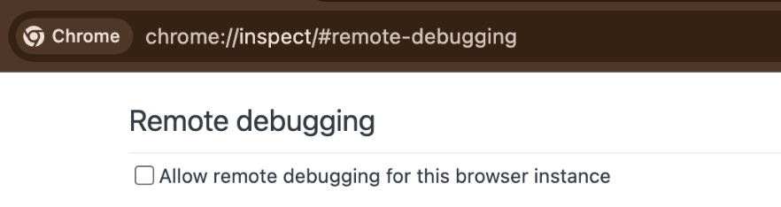

# EffectMaker Harness

Reusable automation for [YouTube Effect Maker](https://effects.youtube.com/home), with English UI helpers and a [Browser Harness](https://github.com/browser-use/browser-harness) adapter.

- [Skill entry point](skills/effectmaker/SKILL.md)
- [Browser Harness setup and recipes](skills/effectmaker/references/browser-harness.md)
- [JavaScript API](skills/effectmaker/references/api.md)
- [Coverage and limitations](skills/effectmaker/references/coverage.md)

## Setup prompt

Paste this into ChatGPT or Claude desktop app.

```text
Install or update the Effect Maker skill from https://github.com/hanfeisun/effectmaker-skill-cdk-sdk using Git CLI. Register skills/effectmaker as my local $effectmaker skill, install its Browser Harness dependency, and connect to my browser. Set Effect Maker to English (US), preserve existing projects and local customizations, and verify the setup. Keep recordings off unless I ask for them. Use the repository's skill and Browser Harness guide to handle the setup details.
```

Your GitHub account needs access to this private repository. The agent handles the installation steps.

The agent will open `chrome://inspect/#remote-debugging`. On first setup, tick
the checkbox so the agent can connect to your browser:



<sub>Setup image from [Browser Harness](https://github.com/browser-use/browser-harness), used under the [MIT license](docs/browser-harness-LICENSE).</sub>

## How it works

The Python adapter reuses [Browser Harness](https://github.com/browser-use/browser-harness) for its browser connection, CDP, mouse and keyboard operations. The skill adds Effect Maker-specific actions and verification. Codex browser and Playwright/CDP adapters are also available. See the [integration guide](skills/effectmaker/references/browser-harness.md) for technical details.

## Validation

- English live editor: text creation, rename, visibility, cleanup, size change/restoration, save and Math/Add creation/undo.
- English catalog: 79 visible node names observed.
- Historical Chinese UI: 79 node creation/undo checks and 31 SDK operation checks (including restoration steps).
- Real temporary Chromium: Playwright/CDP and Browser Harness integration tests passed, including scoped numeric entry, bounds and invalid/ambiguous target rejection.

These are scoped checks, not a claim that all node execution semantics, AI generation, phone performance or publishing were verified. Historical evidence keeps its original Chinese labels.

## Run tests

```sh
npm install --no-save playwright
npm test
# Include the Browser Harness integration test:
HARNESS_PYTHON=/absolute/path/to/venv/bin/python npm test
```

Set `CHROMIUM_EXECUTABLE` when using a local Chrome executable instead of Playwright's bundled Chromium. Tests create temporary browser profiles and use ports 19223 and 19224. Browser Harness is tested at 0.1.13; the Python test is explicitly skipped if `HARNESS_PYTHON` is unset.

This repository and npm package are private. No credentials, cookies or browser profile data are included.
